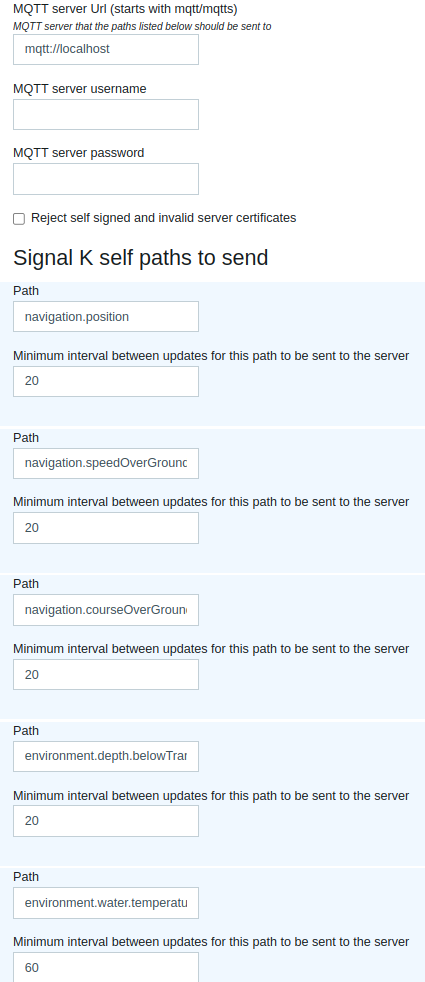

# How to use

## General data flow:

Transducer -> NMEA 2000 -> gateway -> SignalK server -> MQTT broker -> client websocket

## MQTT

Install an MQTT broker:

    sudo apt install mosquitto
    # Not essential, but useful:
    sudo apt install mosquitto-clients

Edit the file `/etc/mosquitto/mosquitto.conf` and add the following lines

    listener 1883
    listener 8080
    protocol websockets
    allow_anonymous true

## Start the SignalK server

    signalk-server

or, for demo data

    signalk-server --sample-n2k-data

## Configure SignalK server

Install the plugin [signalk-mqtt-gw](https://github.com/tkurki/signalk-mqtt-gw) in the SignalK server. This will allow the server to publish to an MQTT
broker.

    cd ~/.signalk
    npm install signalk-mqtt-gw

Figure out which paths you want to watch. You can discover available data streams under the "Data Browser" tab. For
example, `navigation.position` and `environment.depth.belowTransducer` would give location and depth (below transducer),
respectively.

Then configure the plugin in the signalk admin webpage, nominally http://localhost:3000/ to watch those paths and
publish any changes to the broker. Look under "Server", then "Plugin Config", then "Signal K - MQTT Push". Add any
interested paths. You can also set how often they get published.

Example:

| SignalK path                        |  Refresh rate |
|:------------------------------------|--------------:|
| `navigation.position`               |            20 |
| `navigation.speedOverGround`        |            20 |
| `navigation.courseOverGroundTrue`   |            20 |
| `environment.depth.belowTransducer` |            20 |
| `environment.water.temperature`     |            60 |

When you're all done, it should look something like this:

Double check that the topics are getting published:

    mosquitto_sub -h localhost -t '#'

The `-t '#'` says that you want to listen to all topics. 
